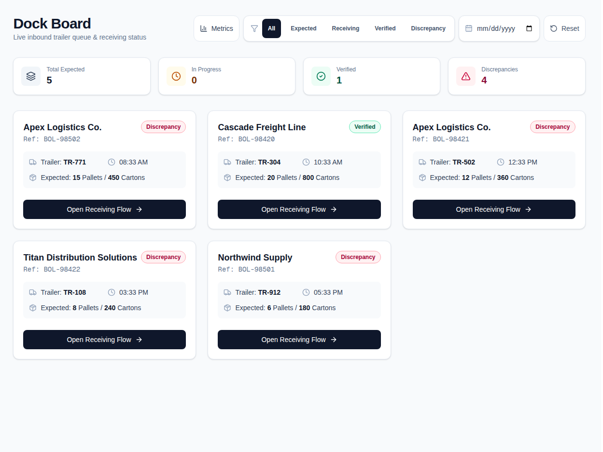
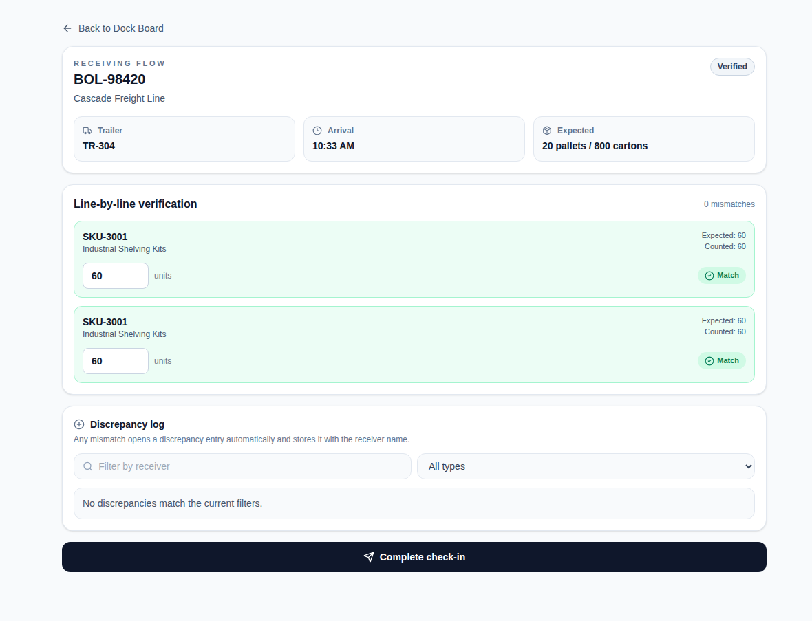

# DockCheck

DockCheck is a production-minded dock receiving workspace for teams under deadline pressure. It gives the receiving team a live view of trailers waiting to be checked in, gives supervisors a clear picture of how the shift is tracking, and captures discrepancies the moment a count does not match so inventory errors do not surface later as a mystery.

[](https://github.com/FranciscoAguero247/dockcheck/actions/workflows/ci.yml)

## The problem

Having spent nearly three years on the dock managing inbound freight under tight daily deadlines, I experienced firsthand how paper-based verification inevitably lets errors slip through the cracks until they surface days later as downstream inventory mysteries. DockCheck is the real-time visibility and tracking tool I wish my team and I had on the floor to eliminate the guesswork for receivers, supervisors, and inventory specialists alike.

## Screenshots

- Dock board overview: 
- Receiving flow: 

## What it does

- Live dock board with status and date filtering
- Mobile-friendly receiving workflow for line-by-line verification
- Automatic discrepancy logging when counts differ
- Supervisory metrics and printable end-of-shift summaries
- Empty states, loading skeletons, and keyboard/touch-friendly controls

## Stack

- Next.js 16 App Router
- React 19
- TypeScript
- Tailwind CSS
- Supabase for storage and realtime data
- Recharts for metrics visuals
- Jest and Testing Library for automated tests

### Key Features
- **Inbound Scheduling & Auditing:** Provides complete data portability for inbound scheduling and auditing, allowing teams to seamlessly export manifest data for external reporting.

## Schema overview

The data model is designed around four core tables:

```text
vendors
  └── shipments
        ├── line_items
        └── discrepancies
```

Key fields include:
- vendors: vendor identity and code
- shipments: trailer, arrival, expected counts, and status
- line_items: expected versus counted quantities per SKU
- discrepancies: mismatch details, type, receiver, and notes

## Demo login

The demo experience is intentionally lightweight for evaluation purposes.

Receiver demo login credentials:
- Email: demo@dockcheck.app
- Password: DockCheck2026!

Supervisor demo login credentials:
- Email: supervisor@dockcheck.app
- Password: Boss-kT6!

## Local setup

1. Install dependencies:
   ```bash
   npm install
   ```
2. Run tests:
   ```bash
   npm test
   ```
3. Run linting:
   ```bash
   npm run lint
   ```
4. Create a production build:
   ```bash
   npm run build
   ```
5. Create a Supabase project and add the following environment variables to `.env.local`:
   ```bash
   NEXT_PUBLIC_SUPABASE_URL=your-project-url
   NEXT_PUBLIC_SUPABASE_ANON_KEY=your-anon-key
   SUPABASE_SERVICE_ROLE_KEY=your-service-role-key
   ```
6. Apply the schema from [scripts/schema.sql](scripts/schema.sql) in the Supabase SQL editor.
7. Seed the data:
   ```bash
   node scripts/seed.mjs
   ```
8. Start the app:
   ```bash
   npm run dev
   ```

## Deployment

### Vercel

1. Push this repository to GitHub.
2. Import the repository into Vercel.
3. Add the same Supabase environment variables in the Vercel project settings.
4. Deploy and visit the generated URL.

### Environment variables

Set these in Vercel or your deployment environment:

```bash
NEXT_PUBLIC_SUPABASE_URL
NEXT_PUBLIC_SUPABASE_ANON_KEY
SUPABASE_SERVICE_ROLE_KEY
```

A template is available in [.env.example](.env.example).
